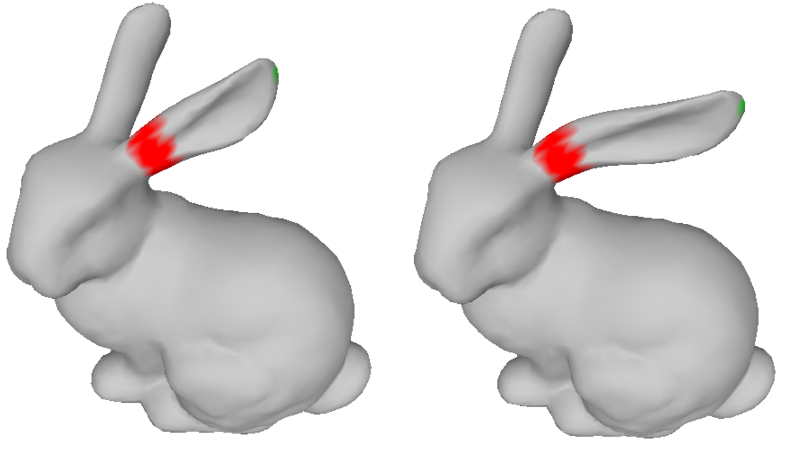

# Geometric-Processing
Implementation of some basic GP algorithms

## 1. [Laplacian Surface Editing](https://graphics.stanford.edu/courses/cs468-07-winter/Papers/sgp2004_laplace.pdf)

Given a Mesh with (V*3) vertices; we edit the mesh specified by handles (marked green). The anchors (marked red) define the boundary beyond which mesh should not be modified.

To run: 

    python src/laplacian_editing.py

Provide a vertex coloured mesh with handles and anchors defined. Specify the list of new positions for handles in code.
